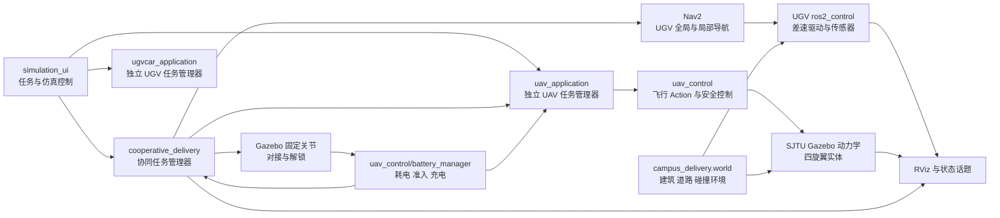
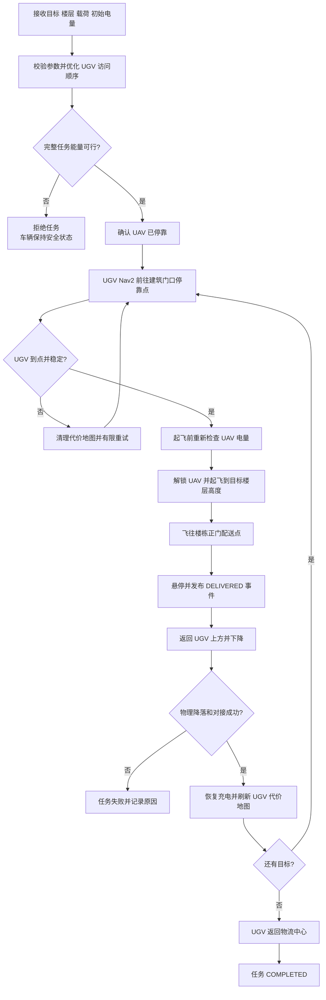
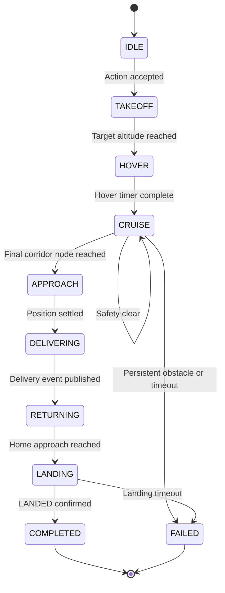
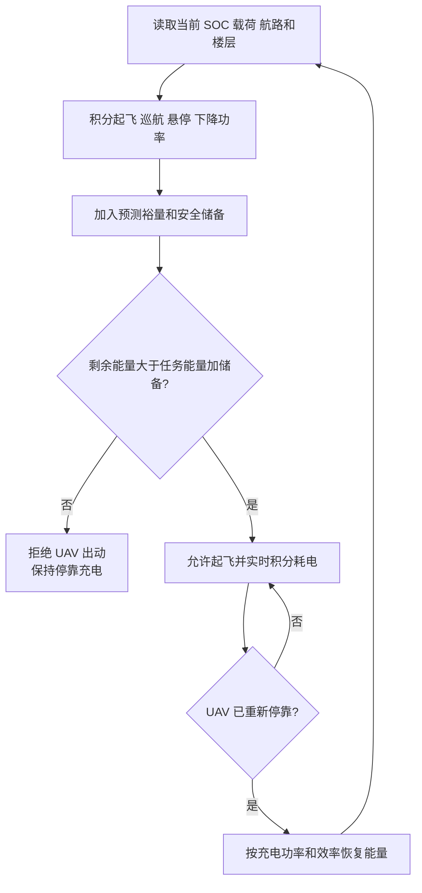

# 校园 UGV-UAV 协同配送系统架构

## 系统边界

本项目的最终交付范围是 Ubuntu 22.04、ROS 2 Humble、Gazebo Classic 和
RViz 上的电脑端物理仿真。系统不依赖开发板、PX4、真实电池或真实电流传感器。

## 软件包职责

| 软件包 | 职责 |
|---|---|
| `ugvcar_description` | UGV 模型、传感器、房间/校园 world、地图生成 |
| `ugvcar_navigation2` | Nav2 地图、代价地图、行为树和启动文件 |
| `ugvcar_application` | UGV 多目标顺序优化与配送执行 |
| `uav_interfaces` | UAV Action 和能量检查 Service |
| `uav_description` | UAV Xacro、碰撞体、3D 雷达和下视传感器 |
| `uav_control` | 起降、定点飞行、安全球、电池与充电模型 |
| `uav_navigation` | 配送楼层点、空中航路图和路径可视化 |
| `uav_application` | UAV 配送状态机和能量准入 |
| `uav_bringup` | 独立 UAV 仿真组合启动 |
| `cooperative_delivery_interfaces` | 空地协同 Action |
| `cooperative_delivery` | UGV-UAV 调度、对接、联合启动和能量序列规划 |
| `simulation_ui` | 五种实验模式、货物配置和进程管理 |
| `vendor/sjtu_drone_description` | 第三方 Gazebo 四旋翼力/力矩动力学插件 |

## 协同配送主流程

UGV 在固定会合点停稳后 UAV 才能解锁。UAV 返回并重新对接后，UGV 才能继续
下一个地面目标或返回物流中心。

## UAV 飞行和安全控制

UAV 使用 Gazebo 力/力矩动力学，不通过持续修改实体坐标模拟飞行。已知建筑由
固定航路图绕开，顶部 3D 雷达、下向测距和四个斜下传感器共同形成三维安全球。

## 电量准入与停靠充电

## 当前设计限制

- UAV 定位使用 Gazebo ground truth，没有实现 SLAM 或 GPS/IMU 融合。
- 未知空中障碍会触发悬停、恢复或中止，不执行在线三维全局重规划。
- UAV 在静止 UGV 上起降，不追踪移动平台。
- 配送使用 ROS 事件模拟卸货，没有实体机械抓取机构。
- 电量是论文模型仿真值，不是实际电池或 ESC 遥测值。

这些限制不影响当前电脑端固定会合点校园配送闭环，但必须在论文中明确说明。
