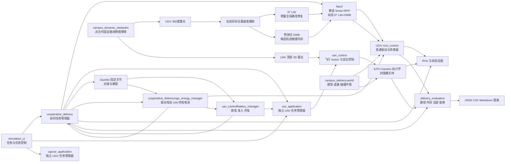
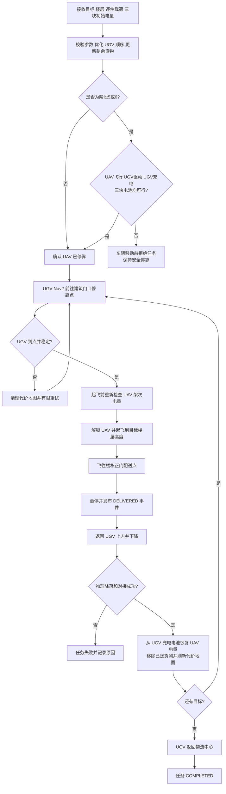
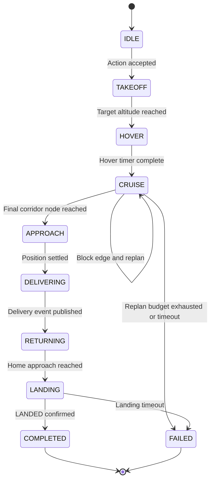
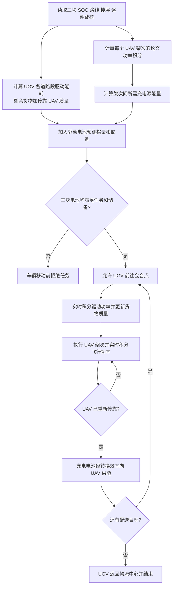
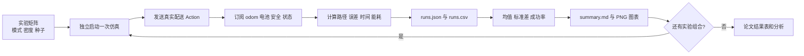

# 校园 UGV-UAV 协同配送系统架构

## 系统边界

本项目的最终交付范围是 Ubuntu 22.04、ROS 2 Humble、Gazebo Classic 和
RViz 上的电脑端物理仿真。系统不依赖开发板、PX4、真实电池或真实电流传感器。

```mermaid
flowchart LR
    UI[simulation_ui<br/>任务与仿真控制] --> CM[cooperative_delivery<br/>协同任务管理器]
    UI --> UA[uav_application<br/>独立 UAV 任务管理器]
    UI --> GA[ugvcar_application<br/>独立 UGV 任务管理器]

    CM --> NAV[Nav2<br/>静态 Smac+RPP<br/>动态 D* Lite+DWB]
    CM --> UA
    CM --> DOCK[Gazebo 固定关节<br/>对接与解锁]

    NAV --> UGV[UGV ros2_control<br/>差速驱动与传感器]
    UA --> FC[uav_control<br/>飞行 Action 与安全控制]
    FC --> UAV[SJTU Gazebo 动力学<br/>四旋翼实体]

    BM[uav_control/battery_manager<br/>耗电 准入 充电] --> UA
    BM --> CM
    UGVBM[cooperative_delivery/ugv_energy_manager<br/>驱动电池 UAV充电电池] --> CM
    UGVBM --> UGV
    UGVBM --> BM
    CM --> UGVBM
    DOCK --> BM
    DOCK --> UGVBM

    WORLD[campus_delivery.world<br/>建筑 道路 碰撞环境] --> UGV
    WORLD --> UAV
    DYN[campus_dynamic_obstacles<br/>非合作固定路线物理障碍] --> US[UGV 360度激光]
    DYN --> AS[UAV 顶部 3D 雷达]
    US --> TRACK[动态目标位置速度跟踪]
    TRACK --> DSTAR[D* Lite<br/>增量全局路径修复]
    TRACK --> PDWA[预测式 DWB<br/>候选轨迹碰撞时间]
    DSTAR --> NAV
    PDWA --> NAV
    NAV --> UGV
    AS --> FC
    UGV --> VIZ[RViz 与状态话题]
    UAV --> VIZ
    CM --> VIZ
    UGV --> METRICS[delivery_evaluation<br/>路径 时间 误差 能耗]
    UAV --> METRICS
    CM --> METRICS
    METRICS --> REPORT[JSON CSV Markdown 图表]
```

## 软件包职责

| 软件包 | 职责 |
|---|---|
| `ugvcar_description` | UGV 模型、传感器、房间/校园 world、地图生成 |
| `ugvcar_navigation2` | Nav2 地图、代价地图、行为树和启动文件 |
| `ugvcar_navigation2_interfaces` | UGV 动态障碍位置、速度、半径和置信度结构化消息 |
| `ugvcar_application` | UGV 多目标顺序优化与配送执行 |
| `uav_interfaces` | UAV Action 和能量检查 Service |
| `uav_description` | UAV Xacro、碰撞体、3D 雷达和下视传感器 |
| `uav_control` | 起降、定点飞行、安全球、电池与充电模型 |
| `uav_navigation` | 配送楼层点、空中航路图和路径可视化 |
| `uav_application` | UAV 配送状态机和能量准入 |
| `uav_bringup` | 独立 UAV 仿真组合启动 |
| `cooperative_delivery_interfaces` | 空地协同 Action |
| `cooperative_delivery` | UGV-UAV 调度、对接、联合启动、双 UGV 电池和能量序列规划 |
| `campus_dynamic_obstacles` | 可复现的非合作地面/空中物理动态障碍，只按固定路线运动 |
| `delivery_evaluation` | 实验矩阵、指标采集、聚合报告和图表 |
| `simulation_ui` | 六阶段实验模式、三电池/货物配置、四档障碍和实时监控 |
| `vendor/sjtu_drone_description` | 第三方 Gazebo 四旋翼力/力矩动力学插件 |

## 协同配送主流程

UGV 在固定会合点停稳后 UAV 才能解锁。UAV 返回并重新对接后，UGV 才能继续
下一个地面目标或返回物流中心。

```mermaid
flowchart TD
    A[接收目标 楼层 逐件载荷 三块初始电量] --> B[校验参数 优化 UGV 顺序 更新剩余货物]
    B --> C{是否为阶段5或6?}
    C -- 否 --> D[确认 UAV 已停靠]
    C -- 是 --> C1{UAV飞行 UGV驱动 UGV充电<br/>三块电池均可行?}
    C1 -- 否 --> R[车辆移动前拒绝任务<br/>保持安全停靠]
    C1 -- 是 --> D
    D --> E[UGV Nav2 前往建筑门口停靠点]
    E --> F{UGV 到点并稳定?}
    F -- 否 --> X[清理代价地图并有限重试]
    X --> E
    F -- 是 --> G[起飞前重新检查 UAV 架次电量]
    G --> H[解锁 UAV 并起飞到目标楼层高度]
    H --> I[飞往楼栋正门配送点]
    I --> J[悬停并发布 DELIVERED 事件]
    J --> K[返回 UGV 上方并下降]
    K --> L{物理降落和对接成功?}
    L -- 否 --> Q[任务失败并记录原因]
    L -- 是 --> M[从 UGV 充电电池恢复 UAV 电量<br/>移除已送货物并刷新代价地图]
    M --> N{还有目标?}
    N -- 是 --> E
    N -- 否 --> O[UGV 返回物流中心]
    O --> P[任务 COMPLETED]
```

## UGV 分层动态导航

阶段 1 至 5 保持 `SmacPlanner2D + Regulated Pure Pursuit`，阶段 6 才启用论文
算法链。激光跟踪器先在地图坐标系估计障碍物位置、速度、半径和运动区域。长时域风险
点进入全局代价地图后，D* Lite 通过 `g/rhs` 局部一致性只修复发生变化的网格，输出
新的黄色 `/plan`。若某一周期的动态代价暂时导致规划失败，行为树保留上一条仍有效
路径，而不是取消控制器并反复清图。

DWB 在每个控制周期生成加速度受限的差速轨迹。预测碰撞评价器对机器人和障碍物建立
相对运动 `r(t) = r0 + v_rel*t`，求解 `||r(t)|| = R_safe` 的最早根作为预计碰撞
时间。无碰撞候选再按预测净空、路径对齐和目标进度排序。该评价使用完整二维相对速度，
因此前方、侧向和斜后方障碍进入同一套实时路径评价，不执行固定避让动作。详细公式、
论文映射和回归结果见 `paper_based_dynamic_navigation.md`。

## UAV 飞行和安全控制

UAV 使用 Gazebo 力/力矩动力学，不通过持续修改实体坐标模拟飞行。已知建筑由
固定航路图绕开，顶部 3D 雷达、下向测距和四个斜下传感器共同形成三维安全感知。
当 3D 雷达在目标方向前方 `5 m` 内发现冲突时，控制器锁定一次切向绕行点，越过
障碍后继续原目标；`1.8 m` 安全球负责紧急保护。持续阻塞时再标记当前航路边并
重新运行 Dijkstra；图上没有可用替代路线时，控制器在高度边界和安全半径内选择
局部三维绕行点。最多重规划次数用于防止任务在不可达障碍前无限循环。

```mermaid
stateDiagram-v2
    [*] --> IDLE
    IDLE --> TAKEOFF: Action accepted
    TAKEOFF --> HOVER: Target altitude reached
    HOVER --> CRUISE: Hover timer complete
    CRUISE --> APPROACH: Final corridor node reached
    APPROACH --> DELIVERING: Position settled
    DELIVERING --> RETURNING: Delivery event published
    RETURNING --> LANDING: Home approach reached
    LANDING --> COMPLETED: LANDED confirmed
    CRUISE --> CRUISE: Safety clear
    CRUISE --> CRUISE: Block edge and replan
    CRUISE --> FAILED: Replan budget exhausted or timeout
    LANDING --> FAILED: Landing timeout
    COMPLETED --> [*]
    FAILED --> [*]
```

## 电量准入与停靠充电

```mermaid
flowchart TD
    A[读取三块 SOC 路线 楼层 逐件载荷] --> B[计算每个 UAV 架次的论文功率积分]
    A --> C[计算 UGV 各道路段驱动能耗<br/>剩余货物加停靠 UAV 质量]
    B --> D[计算架次间所需充电源能量]
    C --> E[加入驱动电池预测裕量和储备]
    D --> E
    E --> F{三块电池均满足任务和储备?}
    F -- 否 --> R[车辆移动前拒绝任务]
    F -- 是 --> G[允许 UGV 前往会合点]
    G --> H[实时积分驱动功率并更新货物质量]
    H --> I[执行 UAV 架次并实时积分飞行功率]
    I --> J{UAV 已重新停靠?}
    J -- 否 --> I
    J -- 是 --> K[充电电池经转换效率向 UAV 供能]
    K --> L{还有配送目标?}
    L -- 是 --> G
    L -- 否 --> M[UGV 返回物流中心并结束]
```

UGV 驱动电池和 UAV 充电电池互不混用。驱动功率随速度、加速度、转向、滚阻、
空气阻力以及总质量变化；总质量包含 UGV 本体、尚未送出的货物和已停靠 UAV。
充电电池只在 UAV 成功停靠时供能，并在自身达到 `10%` 储备后停止充电。

## 自动实验数据流

```mermaid
flowchart LR
    A[实验矩阵<br/>模式 密度 种子] --> B[独立启动一次仿真]
    B --> C[发送真实配送 Action]
    C --> D[订阅 odom 电池 安全 状态]
    D --> E[计算路径 误差 时间 能耗]
    E --> F[runs.json 与 runs.csv]
    F --> G[均值 标准差 成功率]
    G --> H[summary.md 与 PNG 图表]
    H --> I{还有实验组合?}
    I -- 是 --> B
    I -- 否 --> J[论文结果表和分析]
```

动态障碍的最小净空和安全悬停只在巡航、返航和目标接近阶段统计，不把正常起飞或
降落时接近地面计入避障指标。详细变量与公式见 `evaluation_method.md`。

## 当前设计限制

- UAV 定位使用 Gazebo ground truth，没有实现 SLAM 或 GPS/IMU 融合。
- UAV 支持航路边重规划和局部三维绕行，但没有在线构建三维全局占据地图。
- UAV 在静止 UGV 上起降，不追踪移动平台。
- 配送使用 ROS 事件模拟卸货，没有实体机械抓取机构。
- 电量是论文模型仿真值，不是实际电池或 ESC 遥测值。

这些限制不影响当前电脑端固定会合点校园配送闭环，但必须在论文中明确说明。
